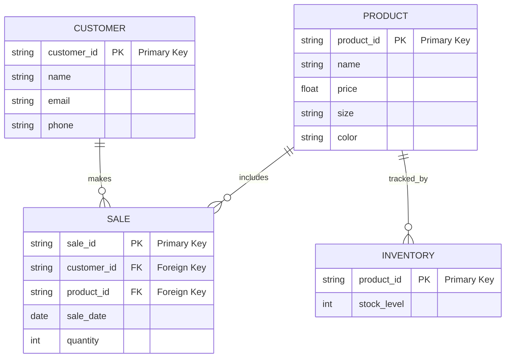

## Hi there 👋
Dennis dawright4@my.waketech.edu
school assignment 
school assignment with the name gopherman126
I made the repository then cloned it

# About Me
## My Interests
## Websites I Recommend
- [Yahoo](https://www.Yahoo.com) - I find yahoo very nice
for researching all kinds of information.
- [youtube](https://www.youtube.com) - Youtube lets me see and
- find new things and entertainment.

# Nike Store ERD

PRODUCT: Different types of Nike shoes. Each product has a unique ID (product_id), a name, price, size, and color.

CUSTOMER: Information about customers who buy shoes. It includes a unique ID (customer_id), name, email, and phone number.

SALE: Records the sales transactions. Each sale has a unique ID (sale_id), links to a customer and a product, the sale date, and the quantity sold.

INVENTORY: Keeps track of how many of each shoe model are in stock. Each entry is linked to a product using product_id and shows the stock level.

Customer to Sale: A customer can make multiple purchases. This is shown by the makes relationship.

Product to Sale: A product can be sold in many transactions. This is represented by the includes relationship.

Product to Inventory: Each product is linked to its inventory record to show how many are available. This is shown by the tracked_by relationship.

These relationships show how the shoe store works. They help track what customers buy and manage how many shoes are in stock. This setup makes it easier to provide good customer service and keep everything organized.
